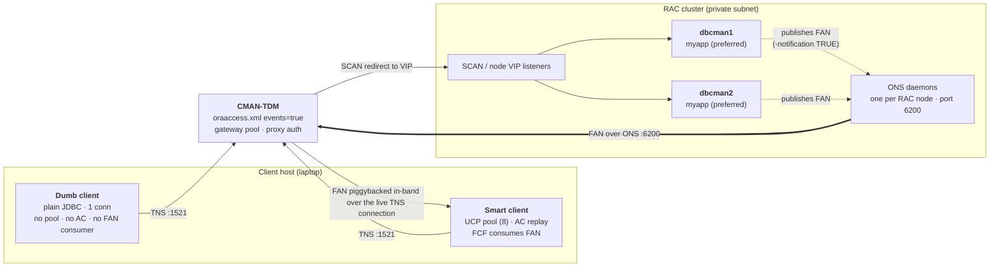
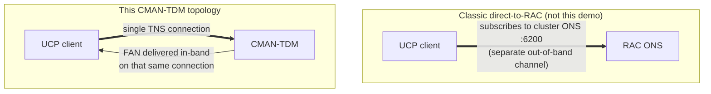
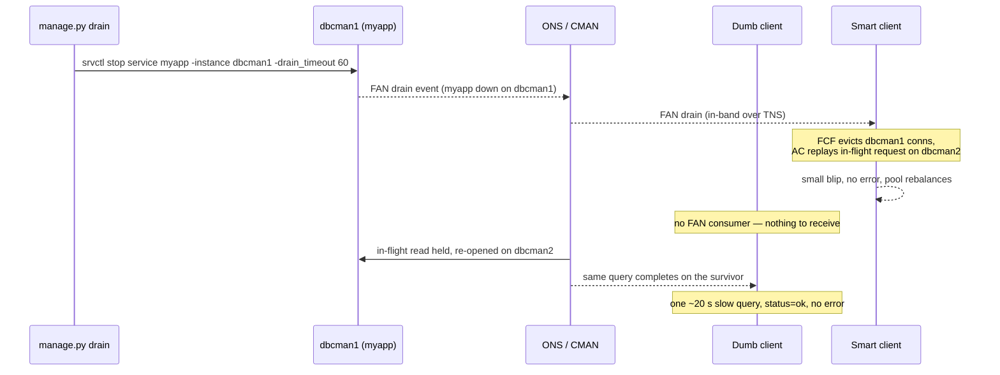

# FAN, FCF, ONS, and the `myapp` service

The continuity story behind the showcase: what each acronym means, **where every piece runs in this
CMAN-TDM + RAC topology**, how a FAN event travels from a draining RAC node to each client, and why
the "dumb" and "smart" clients behave so differently on the same drain. The runbook is in
[DEMO.md](DEMO.md); the cmctl / SQLcl / `srvctl` reference and log locations are in
[REFERENCE.md](REFERENCE.md).

## The vocabulary

| Term    | Full name                          | Side           | Role                                                                                                    |
| ------- | ---------------------------------- | -------------- | ------------------------------------------------------------------------------------------------------- |
| **FAN** | Fast Application Notification      | server         | The _event_. The cluster publishes "service down / draining / up / load rebalanced" messages.           |
| **FCF** | Fast Connection Failover           | client         | The _reaction_. A connection pool subscribes to FAN and proactively evicts, rebalances, and reconnects. |
| **ONS** | Oracle Notification Service        | both           | The _transport_. The pub/sub daemon mesh that carries FAN messages between nodes, CMAN, and clients.    |
| **AC**  | Application Continuity             | client         | _Replays_ the in-flight transaction on the survivor after a failure — independent of FCF.               |
| **TAC** | Transparent Application Continuity | server-enabled | AC with no app-side bookkeeping, switched on by `-failovertype AUTO` on the service.                    |

The relationship in one line: **FAN is the signal, ONS is the wire it travels on, FCF is the pool
reacting to it, AC replays whatever was in flight when it reacted.** FAN and FCF are two halves of
the same mechanism — the database side that _emits_ and the client side that _acts_.

## Where each piece runs in this topology



Reading the diagram:

- **The RAC nodes publish FAN.** The `myapp` service carries `-notification TRUE`, so when an
  instance stops, drains, or starts the service, the local **ONS daemon** (part of Grid
  Infrastructure, one per node, listening on **port 6200**) emits a FAN message.
- **CMAN receives FAN over ONS and acts on it in-band.** `oraaccess.xml` sets `<events>true</events>`,
  which makes CMAN a FAN consumer: it drains its own TDM gateway pool off the affected node _and_
  forwards the event to continuity-aware clients over their existing connection. CMAN subscribes to
  the DB's ONS over port **6200**, opened CMAN→DB by the `cman_eg_db_6200` / `db_in_cman_6200` NSG
  rules.
- **The smart client gets FAN in-band — no direct ONS subscription to the cluster.** Because the
  client reaches the database only through CMAN-TDM, FAN events ride back **in-band** on the same TNS
  connection the client already holds. The client never opens its own ONS socket to the RAC nodes.
  The `ons` and `simplefan` jars must still be on the classpath for UCP's FCF to parse and act on
  those events (see `demo/workload/build.gradle.kts`).
- **The dumb client consumes nothing.** Plain JDBC has no FAN subscriber, so a drain reaches it only
  as connection behavior, never as an event.

### In-band vs. out-of-band FAN — the key distinction

In a classic direct-to-RAC deployment the pool subscribes to the cluster's ONS itself, out-of-band.
This topology routes everything through CMAN-TDM, so FAN is delivered in-band instead:



The practical consequence: the client only needs the one CMAN endpoint and the FAN-capable jars. It
does not need network reachability to the RAC ONS ports, and it does not need a client-side `ons.config`
listing cluster nodes. CMAN is the single funnel for both data and events.

## The `myapp` service — what it is and where it lives

`myapp` is a **RAC database service**, not a separate process or host. A service is clusterware
metadata that says "this named workload runs on these instances with these continuity attributes."
It lives in the cluster registry, runs **inside the PDB** on its **preferred** instances (both
`dbcman1` and `dbcman2`), and is created with Application Continuity attributes:

```bash
srvctl add service -db "$DBUN" -service myapp -pdb "$PDB" -preferred dbcman1,dbcman2 \
  -failovertype AUTO -failover_restore AUTO -commit_outcome TRUE \
  -notification TRUE -drain_timeout 120 -stopoption IMMEDIATE
```

What each attribute buys, in this demo:

- `-failovertype AUTO` — enables **TAC**. Off by default; this is what makes in-flight replay happen
  with no application bookkeeping.
- `-notification TRUE` — the service **publishes FAN**. Without it, draining a node would be silent
  and neither CMAN nor the smart client would react proactively.
- `-drain_timeout 120` — the grace period that starts when a drain (`srvctl stop service ... -drain_timeout`)
  is issued: existing work is allowed to reach a clean request boundary before the service is torn
  down on that instance.
- `-preferred dbcman1,dbcman2` — the service runs on **both** nodes, so a drain off one leaves the
  survivor already serving — no cold start.

A drain is just `srvctl stop service -service myapp -instance dbcman1 -drain_timeout ...`; restore is
`srvctl start service -service myapp`. The cluster keeps `myapp` running on the other node
throughout. `manage.py drain` / `restore` wrap exactly these calls.

## Dumb vs. smart on the same drain

Both clients run the identical query through the identical CMAN endpoint. The difference is entirely
in what the _client_ brings.

|                                 | **Dumb client** (`run-dumb.sh`)                         | **Smart client** (`run-smart.sh`)        |
| ------------------------------- | ------------------------------------------------------- | ---------------------------------------- |
| Driver                          | plain JDBC, single connection                           | UCP pool (8 connections)                 |
| FAN consumer                    | none                                                    | FCF (in-band via CMAN-TDM)               |
| In-flight continuity            | CMAN-TDM holds the read and re-opens it on the survivor | AC replay on the survivor                |
| On a planned drain              | one slow query (~20 s), `status=ok`, **zero errors**    | small blip; pool rebalances across nodes |
| Telemetry shape (single thread) | blank gap while the one call blocks                     | continuous; pool distribution shifts     |
| Failback                        | none — RAC never migrates a live session back           | rebalances on FAN _up_ events            |
| Tag                             | `client=dumb`                                           | `client=smart`                           |



The dumb client is deliberate: it isolates what the **proxy tier** contributes from what the
**driver** contributes. The stable endpoint, access control, topology-hiding, and the "hold the
read and finish it on the survivor" behavior are CMAN's, for any client. Transparent in-flight
continuity with proactive pool rebalancing needs a continuity-aware driver consuming FAN.

## Behaviors that surprise people (and why they are correct)

- **Blocked, but no error.** On a planned drain the dumb client sees a single ~20 s query that
  returns `status=ok` with zero errors — a latency event, not an outage. CMAN-TDM held the in-flight
  read, re-established the backend on the survivor, and completed the _same_ read there. Single-threaded,
  that one blocked call also blocks all telemetry, so the latency panel shows a **blank gap** — the
  client being busy, not downtime. Raising `THREADS` turns the blank gap into "one thread stalls
  while the others keep reporting."
- **The ~20 s also happens with no drain at all — first-query warmup.** The first query on a fresh
  TDM gateway pays a one-time cost while the proxy-auth gateway pool establishes; it can exceed the
  query timeout and shows the same "slow query, no error" shape, triggered by a cold gateway rather
  than a drain. Steady-state queries do not pay it.
- **A clean drain produces no error, only latency.** A query errors only if the backend drops
  mid-flight; a TDM-absorbed drain instead holds the read and finishes it on the survivor, so
  `status` stays `ok` and the cost shows up purely as a `latency_ms` spike (the real ~20 s the dumb
  client was blocked) — not as an error.
- **No failback for the dumb client.** RAC never migrates a live session back to its origin; the
  dumb connection stays wherever it last moved. The smart pool rebalances on FAN _up_ events.
  Draining the _other_ node forces the trip home, so both clients visibly return.
- **Smart client falls back to AC-only if FAN is unreachable.** At startup `SmartWorkload` builds
  the pool with FCF enabled and fires a throwaway probe connection to force pool initialization. If
  FCF cannot be established, the probe throws, and the client logs
  `FAN/FCF unavailable (...); continuing with Application Continuity only` to stdout and rebuilds the
  pool with FCF disabled — it keeps AC replay, just without proactive FAN-driven rebalancing. Grep
  the smart client's console for `FAN/FCF unavailable` to detect this.

## Quick proof points

```bash
# Is the service publishing FAN, and on which instances?
srvctl config service -db "$D" -service myapp        # look for Notification: true, Failover type: AUTO
srvctl status service -db "$D" -service myapp          # which instances serve myapp right now

# Does CMAN see the registration / gateways?
cmctl show services -c cman_proxy

# Did the smart client establish FCF or fall back?
#   look for "FAN/FCF unavailable" in run-smart.sh stdout — absent means FCF is live
```
