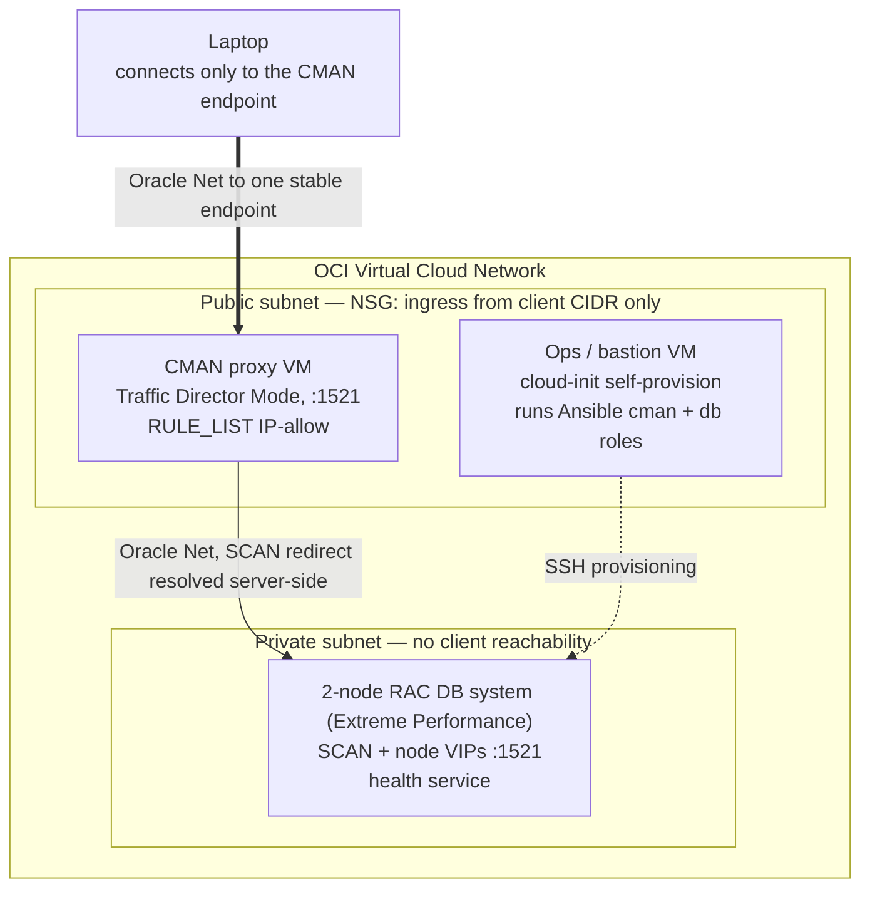

# Oracle Connection Manager (CMAN) Showcase

Oracle Connection Manager (CMAN) acts as a smart, Oracle Net-aware proxy: it parses the TNS protocol, enforces access control by source IP and database service name, routes connections to the right database, and multiplexes sessions. A dumb TCP relay (such as SOCKS5) carries bytes to a destination — it has no concept of service names, cannot enforce service-level rules, and cannot participate in Oracle's Fast Application Notification (FAN)/Application Continuity signaling. That contrast is the thesis of this PoC.

CMAN is deployed in Traffic Director Mode (TDM), the operating mode that adds connection multiplexing and continuity on top of CMAN's proxying and access control. The foundation slice deploys a single CMAN instance on Oracle Cloud Infrastructure (OCI) fronting a private 2-node Real Application Clusters (RAC) DB system. The laptop connects to one stable CMAN endpoint and never addresses the RAC nodes directly; CMAN resolves Single Client Access Name (SCAN) redirects server-side and forwards Oracle Net sessions into the private subnet.

## Architecture (foundation slice)

A verified laptop→CMAN→RAC query runs `select instance_name from v$instance` through the one endpoint, returning a node name from inside the private subnet the laptop never addressed directly.

## Next steps

- **Provision the stack** — [DEPLOY.md](DEPLOY.md): ordered `manage.py` steps from `setup` to a verified end-to-end connection.
- **See it work** — [DEMO.md](DEMO.md): prove the laptop reaches the database only through CMAN.
- **The full vision** — [cman-showcase-design.md](cman-showcase-design.md): the architecture and the eight-use-case roadmap (access-control firewall, service routing, SOCKS5 handoff, TCP↔TCPS translation, connection multiplexing, planned-maintenance draining, SCAN redirect, and transparent database upgrade).
- **What's pending** — [BACKLOG.md](BACKLOG.md): the work that grows this foundation slice into that vision.
