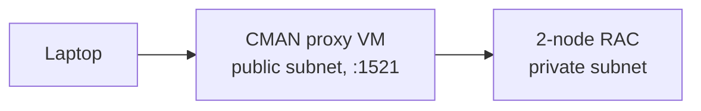

# Oracle Connection Manager (CMAN) Showcase

Oracle Connection Manager (CMAN) acts as a smart, Oracle Net-aware proxy: it parses the TNS protocol, enforces access control by source IP and database service name, routes connections to the right database, and multiplexes sessions. A dumb TCP relay (such as SOCKS5) carries bytes to a destination — it has no concept of service names, cannot enforce service-level rules, and cannot participate in Oracle's FAN/Application Continuity signaling. That contrast is the thesis of this PoC.

CMAN is deployed in Traffic Director Mode (TDM), the operating mode that adds connection multiplexing and continuity on top of CMAN's proxying and access control. The foundation slice deploys a single CMAN instance on Oracle Cloud Infrastructure (OCI) fronting a private 2-node Real Application Clusters (RAC) DB system. The laptop connects to one stable CMAN endpoint and never addresses the RAC nodes directly; CMAN resolves SCAN redirects server-side and forwards Oracle Net sessions into the private subnet.

See [cman-showcase-design.md](cman-showcase-design.md) for the full architecture and the eight-use-case roadmap (access-control firewall, service routing, SOCKS5 handoff, TCP↔TCPS translation, connection multiplexing, planned-maintenance draining, SCAN redirect, and transparent database upgrade).

## Quick reference — `manage.py` verbs

| Verb                        | What it does                                                                                                                           |
| --------------------------- | -------------------------------------------------------------------------------------------------------------------------------------- |
| `setup`                     | Interactive: pick OCI profile, region, compartment, SSH key, client CIDR; generates DB password; writes `.env` and `terraform.tfvars`. |
| `tf <plan\|apply\|destroy>` | Run Terraform against `infra/terraform/` using the generated tfvars.                                                                   |
| `info`                      | Print endpoints and ready-to-paste SSH and connect commands.                                                                           |
| `sql`                       | Save the `cman` SQLcl named connection on the local machine.                                                                           |
| `health`                    | Run a query through the CMAN endpoint via the saved connection and print the instance name.                                            |
| `clean [--destroy]`         | Delete generated files under `infra/terraform/generated/`; with `--destroy` also tears down all provisioned OCI infrastructure.        |
