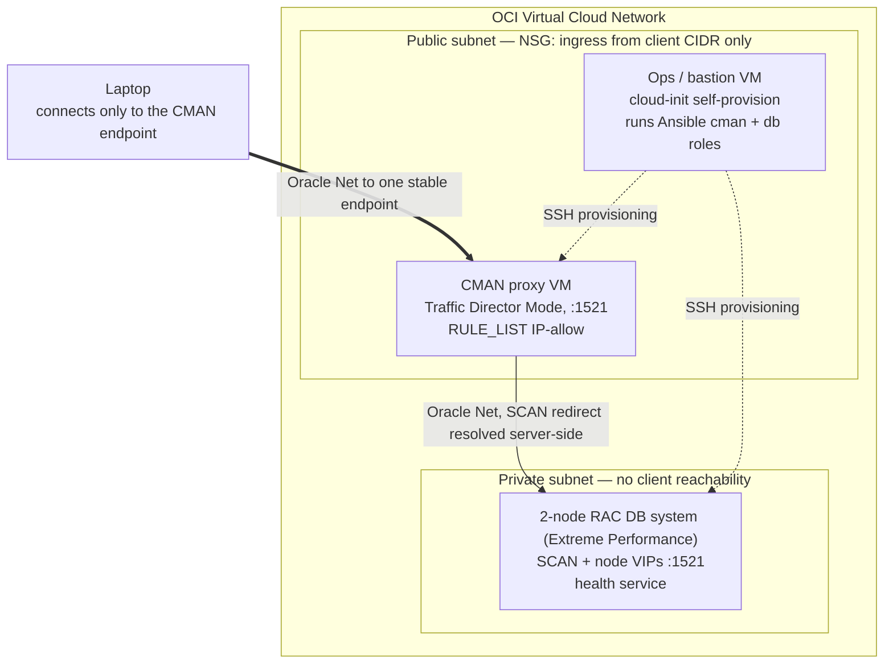
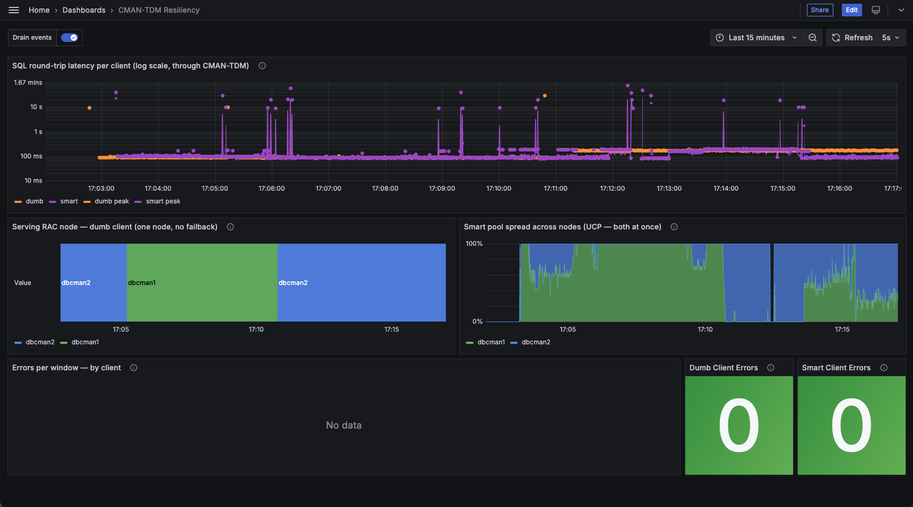

# Oracle Connection Manager (CMAN) Showcase

Oracle Connection Manager (CMAN) is a smart, Oracle Net-aware proxy. It parses the TNS
protocol, enforces access control by source IP and database service name, follows Single Client
Access Name (SCAN) redirects server-side, and multiplexes sessions. A dumb TCP relay (such as a
SOCKS5 proxy) only carries bytes to a destination: it has no concept of service names, cannot
enforce service-level rules, and cannot participate in Oracle's Fast Application Notification
(FAN) signaling. That contrast is the thesis of this showcase.

CMAN runs in **Traffic Director Mode (TDM)** — the mode that adds connection multiplexing and
continuity on top of CMAN's proxying and access control. A laptop connects to **one stable CMAN
endpoint** and never addresses the Real Application Clusters (RAC) nodes directly. CMAN resolves
the SCAN redirect itself and forwards the Oracle Net session into the private subnet.

## Why a smart proxy

CMAN does not implement high availability. FAN, Application Continuity, RAC, and Active Data
Guard are the **database's** machinery; CMAN-TDM is the network-tier proxy that consumes their
signals and hides the churn behind one endpoint.

| Layer                       | Owner                           | Role                                                                                       |
| --------------------------- | ------------------------------- | ------------------------------------------------------------------------------------------ |
| **RAC / Active Data Guard** | Database topology               | Provides a healthy place to fail over to — another live instance or a standby.             |
| **FAN** (via ONS)           | Grid Infrastructure             | The signaling bus: publishes service `DOWN`/`UP` and "start draining" events.              |
| **AC / TAC**                | Database + Oracle client driver | Records in-flight work and replays it on a fresh connection after failover.                |
| **CMAN-TDM**                | Network proxy tier              | Subscribes to FAN, drains and re-routes work, hides the topology, fronts the one endpoint. |

A modern driver talking directly to RAC can already do Application Continuity, so AC by itself is
not where CMAN is irreplaceable. Where CMAN cannot be substituted is the **stable client endpoint
that survives the backend moving**: clients keep one address while the database is patched,
migrated, or upgraded behind it. A direct connection string is bound to a specific cluster's SCAN,
so moving the database forces every client to be reconfigured; behind CMAN the same move is a
server-side re-point of the proxy's routing — no client change. That endpoint stability, bundled
with firewalling, topology-hiding, private-endpoint protection, and multiplexing in one tier, is
the value a smart driver alone cannot reproduce.

## Architecture

A laptop→CMAN→RAC query runs `select instance_name from v$instance` through the one endpoint and
returns a node name from inside the private subnet the laptop never addressed directly. Drain that
node and a Grafana dashboard shows what CMAN-TDM does for a client that has no continuity logic of
its own.

## Observability

Two Java clients drive the same steady workload through CMAN-TDM and ship metrics to InfluxDB; the
**CMAN-TDM Resiliency** Grafana dashboard plots them side by side while nodes are drained. A **dumb
client** (plain JDBC, one connection) isolates what the proxy tier alone contributes; a **smart
client** (UCP pool + Application Continuity) adds in-flight replay.

The capture above is a drain sequence (`dbcman1` → `dbcman2` → `dbcman1`), with the red **Drain
events** annotations marking each step. What each panel shows:

- **SQL round-trip latency per client** — steady state sits in a tight ~100 ms band for both
  clients (orange = dumb, purple = smart); a drain shows as a brief spike, and the single-threaded
  dumb client also leaves a short gap while it blocks. No request fails — a drain is a latency
  event, not an outage.
- **Serving RAC node — dumb client** — the one plain connection lives on a single node and moves to
  the survivor on a drain, then **stays there**: a live session never fails back when the node
  returns.
- **Smart pool spread across nodes** — the pooled connections serve from **both** nodes at once and
  shift their share onto the survivor during a drain — the contrast to the dumb client's one-node-at-
  a-time view.
- **Total errors** — the headline: **zero** across both clients. Every drain was absorbed.

The runbook for reproducing this — starting both clients and driving the drain/restore steps by
hand — is in [DEMO.md](DEMO.md).

## Substrate

OCI Base Database Service, a VM DB system running 2-node RAC, Enterprise Edition – Extreme
Performance. Extreme Performance is required on Base DB for multi-node RAC and is the only edition
bundling Active Data Guard; Application Continuity requires RAC or Active Data Guard. The whole
stack is stood up on demand by Terraform + Ansible and torn down between sessions for cost control.

## Documentation

- **[DEPLOY.md](DEPLOY.md)** — infrastructure and setup: prerequisites, the Oracle client
  download, and the `manage.py` commands that provision and verify the stack.
- **[DEMO.md](DEMO.md)** — the runbook: the commands that show CMAN working and the highlights of
  each, from the health check to the resiliency drain.
- **[REFERENCE.md](REFERENCE.md)** — the deep dive: CMAN/TDM internals, client types, where the
  logs are, and the relevant cmctl, SQLcl, and DB/RAC (`srvctl`) commands.
