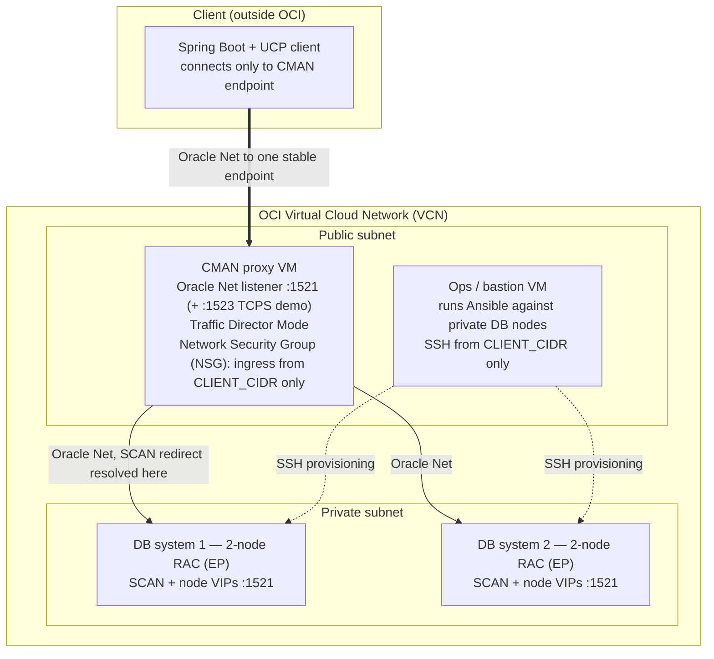

# Oracle Connection Manager (CMAN) Showcase — Design

A fully deployable Oracle Cloud Infrastructure (OCI) Proof of Concept that demonstrates Oracle Connection Manager (CMAN) and its Traffic Director Mode (CMAN-TDM) as a **protocol-aware database proxy**: a single stable endpoint that does access control, service routing, protocol translation, connection multiplexing, and — backed by Real Application Clusters (RAC) and Active Data Guard — transparent high availability and zero-downtime database upgrades.

Where a dumb TCP relay (such as a SOCKS5 proxy) can only carry bytes to a private database, this PoC proves what a **smart, Oracle Net-aware proxy** adds on top.

---

## What this PoC proves

A client application points at one address — the CMAN endpoint — and never changes that address while, behind CMAN:

- connections are accepted or rejected by source IP **and database service name**;
- different services route to different databases;
- the proxy terminates/originates TLS on the client's behalf;
- a database instance fails or is taken down for maintenance, and in-flight work **continues** instead of erroring;
- the database is **upgraded** to a new version, transparently.

A dumb TCP/SOCKS5 proxy can do none of the last three, because it never parses Oracle Net. That contrast is the thesis.

---

## Background: who owns what

CMAN does not implement high availability. Fast Application Notification (FAN), Application Continuity, RAC, and Active Data Guard are the **database's** machinery. CMAN-TDM is the network-tier proxy that _consumes_ their signals, hides the churn behind one endpoint, and can deliver their benefits to clients that could not get them alone.

| Layer                                                  | Owner                           | Role                                                                                                                              |
| ------------------------------------------------------ | ------------------------------- | --------------------------------------------------------------------------------------------------------------------------------- |
| **RAC / Active Data Guard**                            | Database topology               | Provides a healthy place to fail over to — another live instance or a standby. Application Continuity is meaningless without one. |
| **FAN** (Fast Application Notification, via ONS)       | Grid Infrastructure             | The signaling bus: publishes service `DOWN`/`UP` and planned-maintenance "start draining" events.                                 |
| **AC / TAC** (Application Continuity / Transparent AC) | Database + Oracle client driver | Records a session's in-flight work and replays it on a fresh connection after failover, so the application sees no error.         |
| **CMAN-TDM**                                           | Network proxy tier              | Subscribes to FAN, drains and re-routes work, hides the topology, and can perform the continuity on the client's behalf.          |

CMAN-TDM's distinct contributions:

1. **It consumes FAN and drains.** On a planned-maintenance event it stops sending new work to the affected instance, lets in-flight requests finish (bounded by `drain_timeout`), then routes onward to a surviving instance.
2. **It provides continuity on behalf of clients that cannot.** AC/TAC normally needs a modern, correctly configured Oracle driver. CMAN-TDM can hold session state and do failover/restore itself, so even an old client (11.2+) or a non-AC app gets continuity — configured **once at the router**, not per application.
3. **It hides the topology.** RAC's Single Client Access Name (SCAN) listener redirects a client to a node VIP; CMAN resolves that redirect **server-side**, and with Data Guard it fronts the role change too. The client only ever talks to CMAN.

Honest positioning: a modern driver talking directly to RAC can do AC/TAC without CMAN, so AC by itself is not where CMAN is irreplaceable. Where CMAN cannot be substituted is the **stable client endpoint that survives the backend moving**: clients keep one address while the database is migrated to new hardware, patched, or upgraded behind it. A direct connection string is bound to a specific cluster's SCAN, so moving the database forces every client to be reconfigured; behind CMAN the same move is a server-side re-point of the proxy's routing — no client change — and when the destination is a RAC/Data Guard pair, in-flight work **drains and continues** rather than merely reconnecting. CMAN does not perform the migration (Data Guard, RMAN, and ZDM do); it makes the migration transparent to clients. That endpoint stability — bundled with proxying, firewalling, topology-hiding, private-endpoint protection, and multiplexing in one tier — is the value a smart driver cannot reproduce.

---

## Substrate

OCI **Base Database Service**, two VM DB systems, each **2-node RAC**, **Enterprise Edition – Extreme Performance**.

Extreme Performance is required on Base DB for multi-node RAC and is the only edition bundling Active Data Guard; Application Continuity requires RAC or Active Data Guard. So Extreme Performance is the entry price for the headline features, and both DB systems being RAC means a migration's _destination_ also offers FAN/AC — letting CMAN drain off one cluster and have clients **continue** on the other, not merely reconnect.

Why not the lighter substrates:

| Substrate                         | Verdict                                                                                                                                                       |
| --------------------------------- | ------------------------------------------------------------------------------------------------------------------------------------------------------------- |
| Oracle Database Free (containers) | Caps at 2 CPU / 2 GB / 12 GB, one instance per container, **no RAC, Data Guard, AC, or TAC** — cannot demonstrate the HA/upgrade tier at all.                 |
| Autonomous Database               | Hides RAC/routing by design, so CMAN's SCAN-redirect and topology-hiding value can't be shown; less control over services, listeners, and maintenance timing. |
| Base DB, 2× 2-node RAC EP         | Full control of editions, services, RAC, Data Guard, and maintenance windows — every use-case is demonstrable.                                                |

The two DB systems run as **independent clusters** by default (for routing and migration scenarios) and are **pairable as Active Data Guard** for the rolling-upgrade scenario.

---

## Topology



- **CMAN proxy VM** (public subnet): the only address the client knows. Runs CMAN-TDM.
- **Ops/bastion VM** (public subnet): runs Ansible against the private DB nodes over SSH — a standard bastion pattern. May co-host CMAN early; kept separate in the reference layout for clarity.
- **Two RAC DB systems** (private subnet): unreachable from the client network; only CMAN and the ops host reach them.
- An **ONS proxy** runs on the CMAN host only for the scenario where the client application itself subscribes to RAC FAN events through CMAN; the basic CMAN-driven draining path does not need it.

---

## Use-case catalogue

Each use-case is an independent demo against the same deployed stack.

1. **Access-control firewall.** `RULE_LIST` accepts/rejects by source IP **and** service name, default-deny. Proves the service-name filtering a TCP/SOCKS5 proxy cannot do.
2. **Service / multi-tenant routing.** One CMAN endpoint routes service `SALES` to cluster 1 and `HR` to cluster 2 (independent-cluster mode).
3. **SOCKS5 → CMAN handoff.** A SOCKS5 dumb TCP relay sits in front of CMAN: SOCKS5 carries bytes, CMAN adds Oracle Net awareness (rules, routing, HA). Embodies the "dumb valve + smart brain" split.
4. **TCP ↔ TCPS protocol translation.** Client connects plain TCP; CMAN holds the wallet and originates mutual TLS to the database. The proxy owns the crypto; the client is unaware of the wallet.
5. **Connection multiplexing (PRCP).** Many client connections funnel onto fewer database sessions via Proxy Resident Connection Pooling, pool managed on the CMAN tier.
6. **Planned-maintenance draining (AC/TAC).** A service is stopped/relocated on cluster 1; CMAN drains in-flight work at request boundaries and continues it on a surviving instance. The client running a workload sees no error.
7. **RAC SCAN redirect, resolved server-side.** CMAN follows the SCAN redirect to a node VIP itself; the client never sees or routes to VIPs.
8. **Transparent platform migration and upgrade.** The two clusters are paired as Active Data Guard; a switchover — to new hardware, a patched home, or a new database version — happens behind CMAN while a client workload keeps running. Clients keep the one CMAN endpoint throughout, so the move is a server-side re-point of the proxy's routing, not a fleet-wide connection-string change. This is the "platform upgrade" headline, delivered transparently rather than as documented indirection.

---

## Repository layout

A single deployable project, self-contained.

```
cman-showcase/
  README.md                 # value prop, topology, decisions, use-case map
  DEPLOY.md                 # ordered, copy-pasteable provisioning steps
  DEMO.md                   # per-use-case validation walkthrough
  manage.py                 # Typer orchestrator (setup / tf / build / run / demo / health)
  pyproject.toml
  .env                      # generated by `setup`, never hand-edited
  infra/
    terraform/              # VCN, subnets, NSGs, 2× db_system (RAC), CMAN VM, ops VM
  ansible/
    cman/                   # role: install + configure CMAN-TDM (cman.ora, oraaccess.xml, wallet)
    db/                     # role: create AC-enabled services, enable ONS, Data Guard pairing
  app/                      # Spring Boot + UCP client used by the HA/draining demos
  docs/
    scenarios.md            # variations: editions, on-prem, multi-cloud, GoldenGate
```

---

## Orchestrator verbs (`manage.py`)

A Typer-based orchestrator — one entry point for the whole lifecycle.

| Verb                                                                 | Action                                                                                                                                                        |
| -------------------------------------------------------------------- | ------------------------------------------------------------------------------------------------------------------------------------------------------------- |
| `setup`                                                              | Interactive: pick profile/region/compartment, SSH key, client CIDR; generate DB passwords; write `.env` and `terraform.tfvars`.                               |
| `tf apply`                                                           | Provision the VCN, NSGs, two RAC DB systems, the CMAN VM, and the ops VM. Ops host self-provisions via cloud-init and runs the Ansible `cman` and `db` roles. |
| `info`                                                               | Print endpoints and ready-to-paste connect/SSH commands.                                                                                                      |
| `build` / `run`                                                      | Build and run the Spring Boot client (used by the draining/upgrade demos).                                                                                    |
| `demo firewall \| route \| socks \| tls \| pool \| drain \| upgrade` | Drive one use-case end to end and assert the expected outcome.                                                                                                |
| `health`                                                             | Confirm an end-to-end query through CMAN.                                                                                                                     |
| `clean --destroy`                                                    | Tear the whole stack down.                                                                                                                                    |

---

## Provisioning flow

1. `setup` discovers OCI context and writes config — nothing edited by hand.
2. `tf apply` stands up the network, both RAC DB systems (private subnet), and the CMAN and ops VMs (public subnet).
3. The ops host **self-provisions via cloud-init**: installs Ansible, pulls the roles, and runs them — configuring CMAN-TDM on the CMAN host and creating AC-enabled services on the databases over SSH. No SSH push from the operator.
4. `demo …` runs each scenario; `clean --destroy` removes everything.

Teardown between sessions is the cost control: the IaC stands the full stack up on demand, so the expensive RAC tier need not run 24/7.

---

## Verified configuration primitives

**CMAN (`cman.ora`)** — Traffic Director Mode plus default-deny rules:

```
cman_proxy =
  (configuration =
    (address = (protocol = tcp)(host = CMAN_HOST)(port = 1521))
    (parameter_list =
      (tdm = true)
      (tdm_threading_mode = dedicated)
      (max_connections = 1024)
      (idle_timeout = 0)
      (inbound_connect_timeout = 60)
      (log_level = user))
    (rule_list =
      (rule = (src = CLIENT_CIDR)(dst = *)(srv = SALES)(act = accept))
      (rule = (src = CLIENT_CIDR)(dst = *)(srv = HR)(act = accept))
      (rule = (src = *)(dst = *)(srv = *)(act = reject))))
```

**CMAN event handling (`oraaccess.xml`)** — required for draining/continuity:

```xml
<oraaccess>
  <default_parameters>
    <events>true</events>
  </default_parameters>
</oraaccess>
```

**AC/TAC service (database, via `srvctl`)** — Transparent Application Continuity:

```
srvctl add service -db DB1 -service sales \
  -failovertype AUTO -failover_restore AUTO \
  -commit_outcome TRUE -notification TRUE \
  -drain_timeout 120 -stopoption IMMEDIATE
```

`FAILOVER_TYPE=AUTO` enables TAC; it is **not** on by default. `drain_timeout` bounds the grace period that starts when the FAN/in-band notification is sent.

**Terraform (OCI provider)** — one resource per DB system; RAC via `node_count`:

```hcl
resource "oci_database_db_system" "db1" {
  node_count      = 2
  database_edition = "ENTERPRISE_EDITION_EXTREME_PERFORMANCE"
  cpu_core_count  = 2
  subnet_id       = oci_core_subnet.private.id
  ssh_public_keys = [var.ssh_public_key]
  # db_home { database { ... } }
}
```

Edition and node count are fixed at create time; changing them is a recreate, not an in-place conversion.

---

## Scope and non-goals

- **In scope:** the eight use-cases above, on two RAC DB systems fronted by one CMAN-TDM instance, fully provisioned by Terraform + Ansible.
- **Out of scope:** Exadata, multi-region, GoldenGate replication routing, and OCI-managed-proxy offerings — documented as variations in `docs/scenarios.md`, not deployed.
- **Security model:** NSG source-IP allowlists plus CMAN `RULE_LIST`; the client app holds DB credentials. ZPR is out of scope.

---

## Items to confirm during implementation

These were not pinned by research and are settled in the build:

- Smallest credible VM shapes, minimum OCPUs, and minimum storage for the two RAC systems; concrete running cost.
- Exact NSG/security-list rules: client→CMAN, CMAN→SCAN/VIP/listener on 1521 (and 1522 for TCPS), ops→DB-node SSH, ONS ports.
- The precise `srvctl` service attributes and the `srvctl stop service` / `relocate` workflow that yield a clean end-to-end draining demo.
- Whether the two systems run different base versions for the upgrade scenario, or use Data Guard rolling upgrade (`DBMS_ROLLING`) between matched systems.

---

## References

Primary Oracle documentation and whitepapers underpinning the design:

- Oracle Net Services Administrator's Guide — _Configuring Oracle Connection Manager_ and _Traffic Director Mode_ (19c / 21c / 26ai).
- Oracle Net Services Reference — _Oracle Connection Manager Parameters_ (`tdm`, `rule_list`, `max_connections`, PRCP tuning).
- CMAN-TDM whitepaper — _Oracle Database Connection Proxy for Scalable Applications_.
- Oracle Solutions — _Secure data with a CMAN proxy in front of Autonomous Database_ (TCP↔TCPS protocol switching).
- Oracle Solutions — multicloud CMAN with ONS proxy reference architecture.
- Oracle Learn — CMAN on OCI Compute in front of Base Database Service.
- OCI Terraform provider — `oci_database_db_system` (`node_count`, `database_edition`).
- Oracle RAC Administration — _Ensuring Application Continuity_ (FAILOVER_TYPE/RESTORE, FAN).
- Base Database Service — editions and feature gating (RAC and Active Data Guard require Extreme Performance).

---

## Next steps

- **Provision the stack** — [DEPLOY.md](DEPLOY.md): ordered `manage.py` steps from `setup` to a verified end-to-end connection.
- **Validate the deployment** — [DEMO.md](DEMO.md): confirm the laptop reaches the database only through CMAN.
